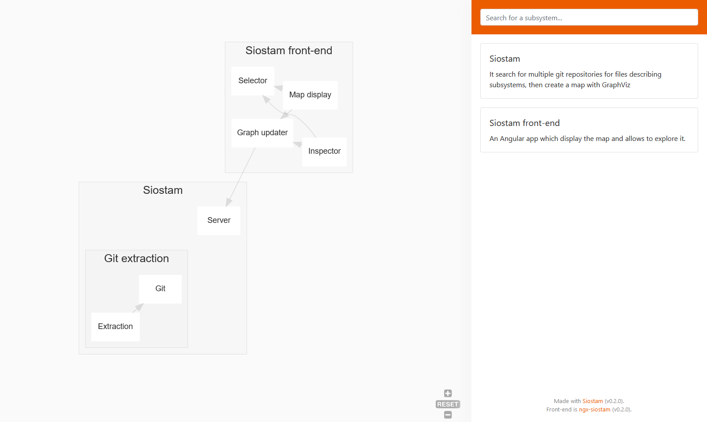

# Siostam

🚧 **Disclaimer**: this project is in early stage of development. Use at your own risks. 🚧

Describe the subsystems of your apps beside your source-code and let Siostam put it into graphs and high-level documentations. It's intended as an entry point documentation. It acts as a portal for the specialised docs (autogenerated, like *Doxygen/JavaDoc/RustDoc*, or not, like *readthedocs*). Siostam search for subsystems' files in your git repos and display it like this:



**Note** : the other part of the app, the front-end, is [ngx-siostam](https://github.com/siostam/ngx-siostam). The graph is made using [GraphViz](https://graphviz.gitlab.io/).


## Install

### Binaries

We will soon™ make binaries available.

### Development environment

Prerequisite:

* [Git](https://git-scm.com/) 
* [Rust (setup with rustup)](https://rustup.rs/) 
* [Graphviz](https://graphviz.gitlab.io/) (must be in PATH environment variable)

Additional prerequisite for the server part:

* [Yarn](https://yarnpkg.com/lang/en/)

```bash
# Download siostam
git clone git@github.com:siostam/siostam.git

# A. One-shot mode: output the graphs and that's it
cd siostam
# Development
cargo run
# Production
cargo run --release

# B. Server mode: render the graphs and display it using the front-end
# For this, you also need to install ngx-siostam
cd ..
git clone git@github.com:siostam/ngx-siostam.git
cd ngx-siostam
yarn
# Aaaand to run it.
ng serve
# You also need to run the server on another command line
cargo run --release -- server
```

### Build

 ````bash
# Build the front end
cd ngx-siostam
ng build --prod

# Build the back-end
cd ../siostam
cargo build --release

# Copy the front-end in the public folder
cp ../ngx-siostam/dist/ngx-siostam/* public/
# All should run on http://localhost:4300/
cargo run --release -- server
 ````

Then run [Inno-setup](https://www.jrsoftware.org/isinfo.php) on `./setup.iss`.

### Docker

The workflow is kind of a work-in-progress but right now, it looks like this

````sh
# Build the front-end
cd ngx-siostam
docker build -t siostam/ngx-siostam:0.2 .
# Publish the front-end
docker push siostam/ngx-siostam:0.2

cd ..

# Build the main image 
cd siostam 
docker build -t siostam/siostam:0.2 .
# Publish it
docker push siostam/siostam:0.2
````

To run the service, create the `docker-compose.yml` file, put the `Siostam.toml` next to it and do `docker-compose up -d` in the same folder :

````yaml
version: '3'
services:
  siostam:
    image: siostam/siostam:0.2
    volumes:
      - "./Siostam.toml:/opt/Siostam.toml:ro"
    ports:
      - "4300:4300"
    environment:
      - SIOSTAM_SERVER_PORT=4300
      - SIOSTAM_SERVER_SOCKET_ADDRESS=0.0.0.0
      - SIOSTAM_INTERVAL_BETWEEN_UPDATES=5min
      - SIOSTAM_GIT_HTTPS_USERNAME=your-username
      - SIOSTAM_GIT_HTTPS_PASSWORD=your-password
    restart: always
````

## Usage

### Configure it

````bash
# Build the config files
siostam init
````

#### General configuration

Then, list the git repositories to scrap in the `Siostam.toml`. 

The `suffix` is used to know which file must be extracted from the repository. With `suffix = "subsystems.toml"`, `foobar.subsystems.toml` will be analysed and `random-config.toml` will not.

For each repo you may set the `url` and `branch` to get git working or you can set the relative path into `folder` to use local files. If `folder` is present, the remote repository is ignored and a warning is issued to make sure you know you are working local; if not, the remote repository is used.

````toml
suffix = "subsystems.toml"

[[targets]]
url = "https://github.com/siostam/siostam"
branch = "master"
# folder = "./src"

[[targets]]
url = "https://github.com/Fanaen/ngx-subsystem-mapper.git"
branch = "master"
# folder = "../ngx-subsystem-mapper"
````

#### Devops and passwords

You may have passwords on your repositories, or you may want to change the port. This stuff can be changed in `.env` or in environment variables:

````ini
SIOSTAM_SERVER_PORT=4300
SIOSTAM_SERVER_SOCKET_ADDRESS=127.0.0.1
SIOSTAM_INTERVAL_BETWEEN_UPDATES=5min

SIOSTAM_GIT_HTTPS_USERNAME=your-username
SIOSTAM_GIT_HTTPS_PASSWORD=your-password

# Not tested yet
# SIOSTAM_GIT_SSH_PRIVATE_KEY=private/id_rsa.pub
# SIOSTAM_GIT_SSH_PUBLIC_KEY=private/id_rsa
# SIOSTAM_GIT_SSH_PASSPHRASE=your-passphrase
````

The `SIOSTAM_INTERVAL_BETWEEN_UPDATES` is set using [humantime](https://docs.rs/humantime/2.0.0/humantime/fn.parse_duration.html) so you can use many formats : `30s`, `45seconds`, `17second`, `1h 20min 17s` etc.  

### Document it

Now is the time to make a bit of documentation. Add `something-something.subsystems.toml` near your `something-something` system with a file like this inside. For example, there is [`src/siostam.subsystems.toml`](https://github.com/siostam/siostam/blob/master/src/siostam.subsystems.toml) :

````toml
# System is between simple brackets: only one per file
# Also, its optional.
[system]
id = "siostam"
name = "Siostam"
description = "It search for multiple git repositories for files describing subsystems, then create a map with GraphViz"

    # You may display how-to links next to the system
    [[system.how_to]]
    url = "https://github.com/siostam/siostam#usage"
    text = "How-to configure Siostam"

# All subsystems below are in the system above (if there is one)
# subsystem are between double brackets: you can use as many as you want
[[subsystem]]
id = "siostam_server"
name = "Server"
description = "Serves the SVG and JSON describing the documentation"

    # You may display how-to links next to the subsystem system
    [[subsystem.how_to]]
    url = "https://github.com/siostam/siostam#usage"
    text = "How-to run the server"
````

You can find another one in [`src/`]()

```toml
# With `stored_in_system`, all systems in this file will be in 
# the designated system.
# Optional feature as well
stored_in_system = "siostam"

[system]
id = "git_extraction"
name = "Git extraction"
description = "It maintains the targetted repository up-to-date in local and search for subsystem files."

[[subsystem]]
id = "git"
name = "Git"
description = "Clone/Open/Update the repository to get them up to date"

[[subsystem]]
id = "extraction"
name = "Extraction"
description = "Search in the repositories' folders for subsystems files"

  # Display a section "dependency" in the subsystem documentation 
  # plus an arrow in the graph
  [[subsystem.dependency]]
  id = "git"
  why = "The repo must be in local and up-to-date to get the files"
```

### Run it

```bash
# One-shot: output the graphs and that's it
siostam

# Server mode: render the graphs and display it using the front-end
siostam server

# Display the help (you can thank https://clap.rs/ for that)
siostam help
```

### See the result

- In the one-shot mode, you can see the result `.dot` and `.svg` files
- In server mode, it will be by default at [http://localhost:4300/](http://localhost:4300/)


## Roadmap

- [x] Make the git scrapper to get the files in your repos
- [x] Make an easy-to-read [front-end](https://github.com/siostam/ngx-siostam)
- [ ] Create an auto-update system
- [ ] Make the app easy to setup using [docker](https://www.docker.com/)

## Contributing

First of all, thanks for taking the time to contribute! 

Please apply the following rules in order to save time for everyone :

1. use [conventional commits](thanks for taking the time to contribute! )
2. before creating the PR, use the format tools `cargo fmt`
3. make sure there is no warning left

## License

Usage is provided under the [MIT License](http://http//opensource.org/licenses/mit-license.php). See LICENSE for the full details.
